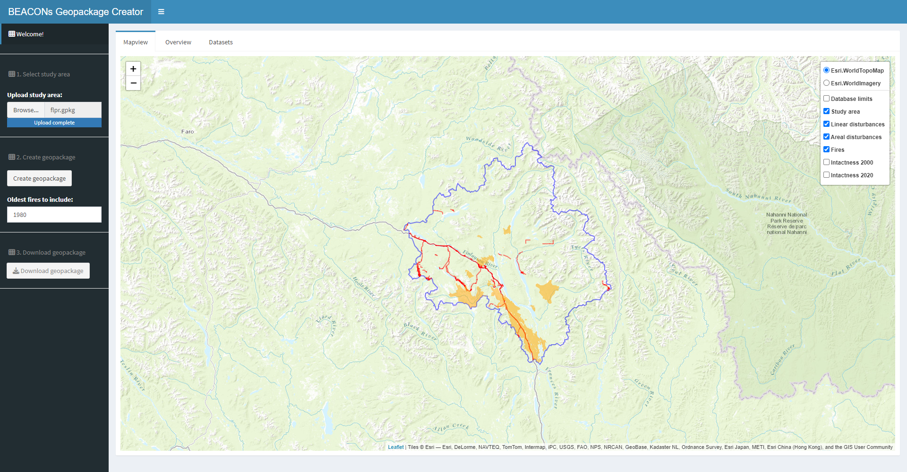
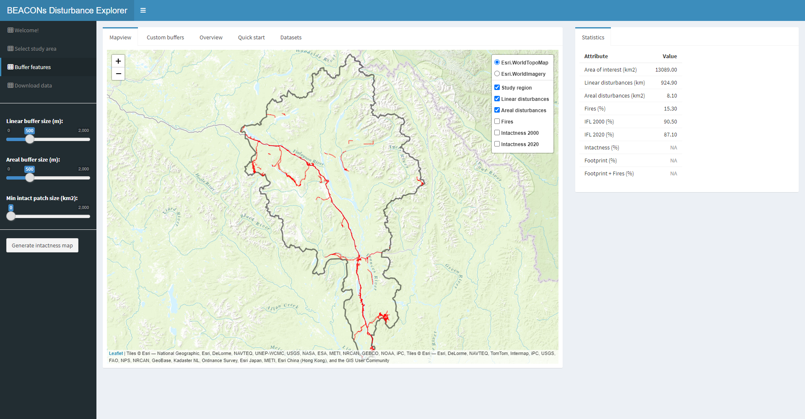
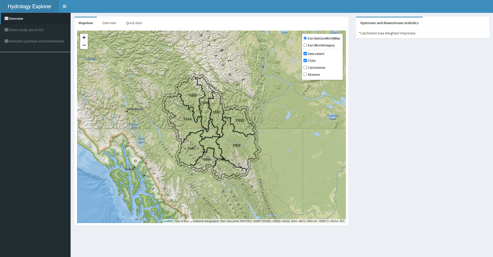
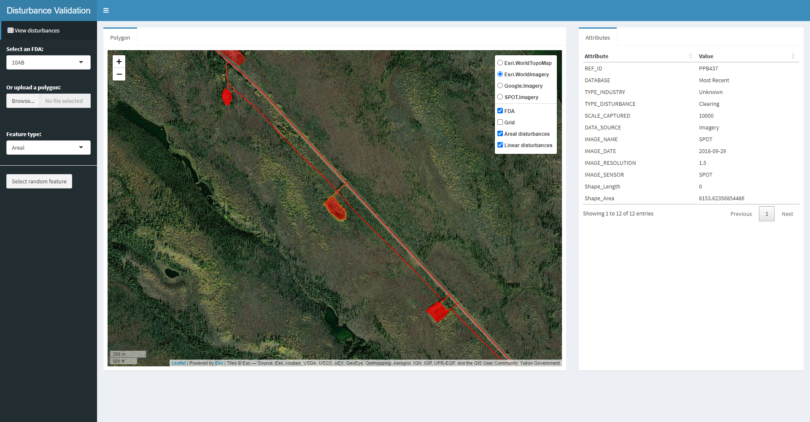
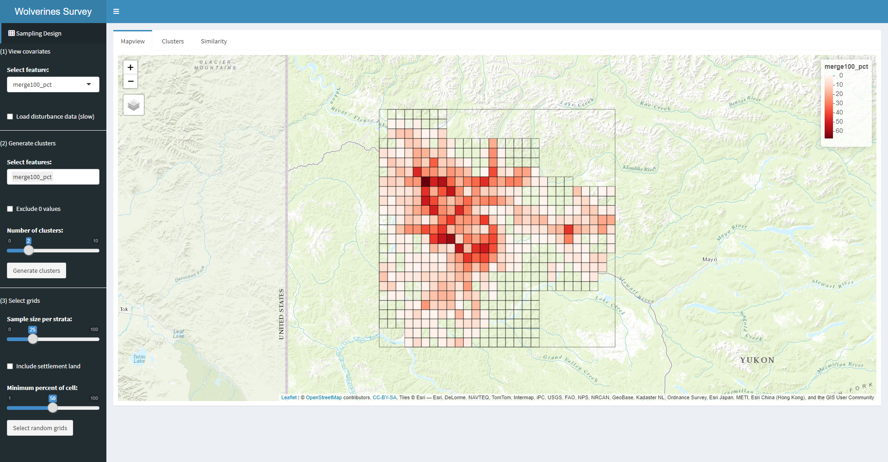
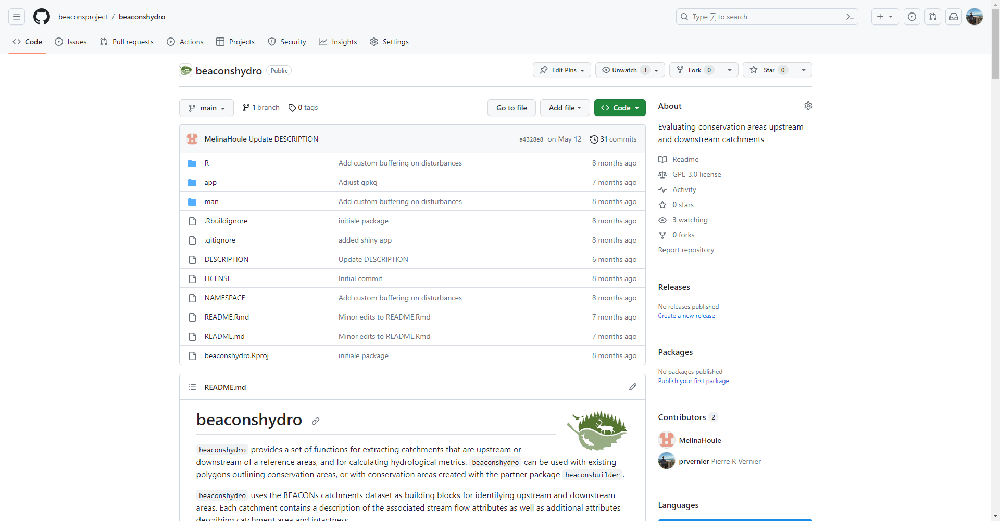
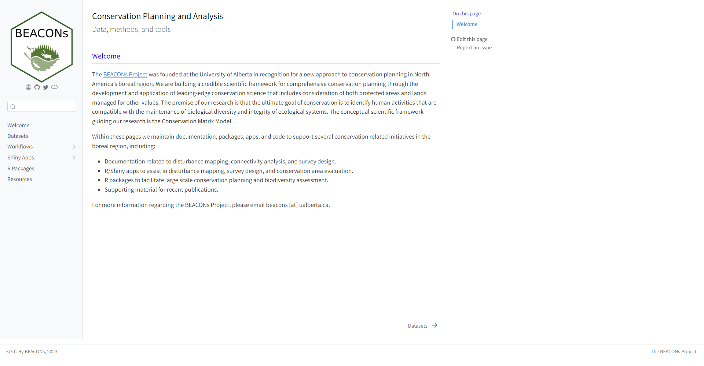
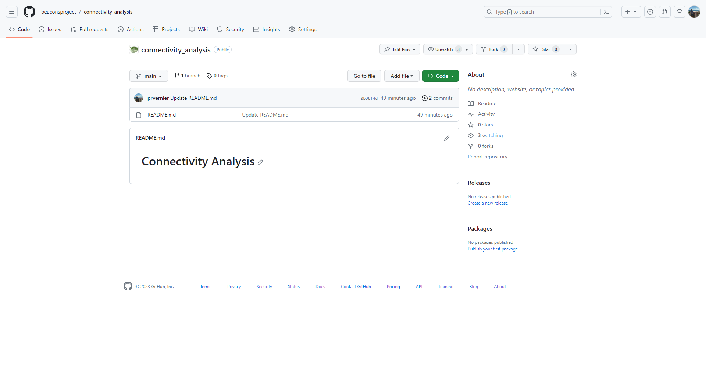

**Welcome to the BEACONs tools pages!**

The [BEACONs Project](https://beaconsproject.ualberta.ca/) was founded at the University of Alberta in recognition for a new approach to conservation planning in North America's boreal region. We are building a credible scientific framework for comprehensive conservation planning through the development and application of leading-edge conservation science that includes consideration of both protected areas and lands managed for other values. The premise of our research is that the ultimate goal of conservation is to identify human activities that are compatible with the maintenance of biological diversity and integrity of ecological systems. The conceptual scientific framework guiding our research is the Conservation Matrix Model.

Within these pages we provide information on the data, methods, and tools that we use for large-scale conservation planning in the boreal region, including:

- R/Shiny apps to assist in conservation planning and assessment.
- R packages to facilitate large scale conservation planning.
- Documentation describing the data, methods, and tools.
- Resources such as bookmarks, presentations, and supporting material from publications.

**Shiny Apps**

| Geopackage Creator | Disturbance Explorer | Hydrology Explorer |
| :---: | :---: | :---: |
| |  |  |

| Conservation Area Explorer | Disturbance Validation | Wolverine Survey Design |
| :---: | :---: | :---: |
|  |  |  |

**R Packages**

| beaconstools | beaconsbuilder | beaconshydro |
| :---: | :---: | :---: |
|  |  |  |

**Documentation pages**

| BEACONs Docs | Disturbance Mapping | Connectivity Analysis |
| :---: | :---: | :---: |
|  |  |  |

## Completed Projects

- [Pan-Boreal Assessment](https://pba.ualberta.ca)
- [Northwest Boreal LCC](https://nwb.ualberta.ca)
- [SFI conservation value assessment tool](https://borealbirds.ca/conservation-value-assessment-tool/)

## Publications (supporting material)

- [Insect paper](https://github.com/beaconsproject/insect-mdr-simulation)
- [Surrogates paper](https://github.com/prvernier/surrogates)
- [Intactness paper](https://github.com/prvernier/intactness)

## Presentations

Wolverines app (Jan 2023)

- [Powerpoint presentation](https://drive.google.com/file/d/15REnFhUNNPtEkyuAeVzRciYvhtz50ZDP/view)
- [App demo](https://www.youtube.com/watch?v=fgQ3PaJIXsg)

BC PARF Forum 2022 (Dec 2022)

- [Regional Disturbance Mapping in SE Yukon and Applications to Conservation Planning](https://cpcil.ca/bcparf-2022-concurrent-conservation-case-studies/)
- [Applications of Disturbance Mapping to Conservation Planning](https://cpcil.ca/bcparf-2022-concurrent-conservation-case-studies/)
