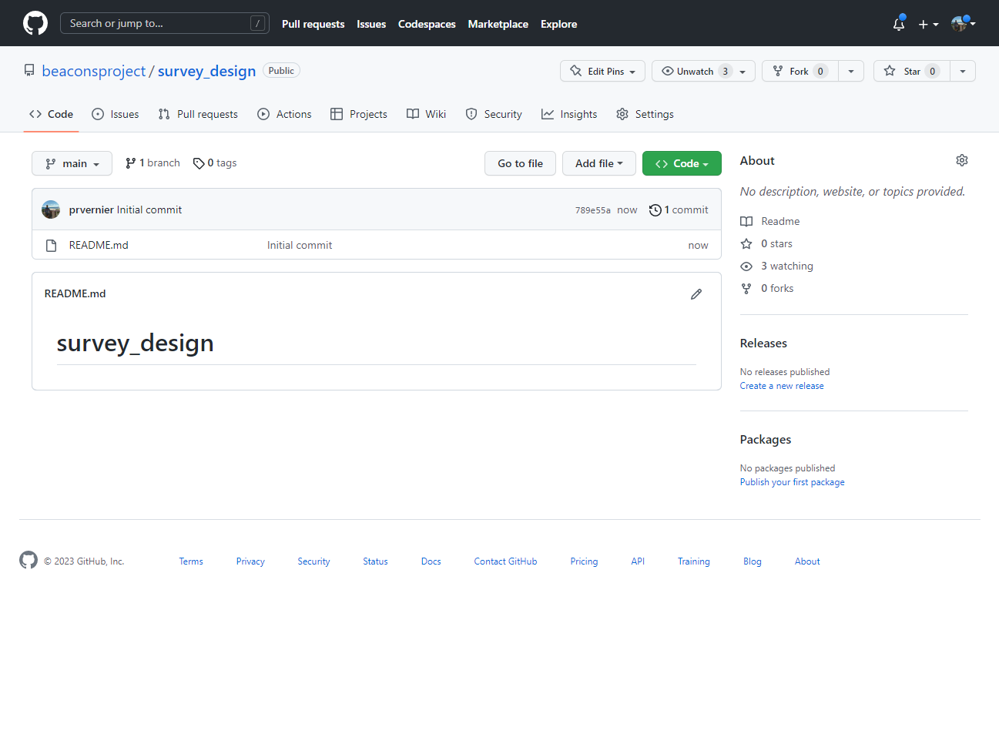

## Welcome to the BEACONs Project

The [BEACONs Project](https://beaconsproject.ualberta.ca/) was founded at the University of Alberta in recognition for a new approach to conservation planning in North America's boreal region. We are building a credible scientific framework for comprehensive conservation planning through the development and application of leading-edge conservation science that includes consideration of both protected areas and lands managed for other values. The premise of our research is that the ultimate goal of conservation is to identify human activities that are compatible with the maintenance of biological diversity and integrity of ecological systems. The conceptual scientific framework guiding our research is the Conservation Matrix Model. On this site we develop and maintain documentation, packages, apps, and code to support various conservation related projects:
* R packages to assist in large scale conservation planning.
* Various R/Shiny apps that assist in survey design, footprint/intactness mapping, etc.
* Google Earth Engine code and apps to support disturbance mapping.
* Documentation to support disturbance mapping and connectivity analyses.

 

## Active Projects

| [Disturbance Mapping Project](https://github.com/beaconsproject/disturbance_mapping) | [Connectivity Mapping Project](https://github.com/beaconsproject/connectivity_mapping) | [Survey Design Project](https://github.com/beaconsproject/survey_design) |
| :---: | :---: | :---: |
|  |  |  |
| Add a description of the disturbance mapping project. | Add a description of the connectivity mapping project. | Add a description of the survey design project. |

 

## Shiny Apps

| [Regional Disturbance Explorer](https://github.com/beaconsproject/regional_disturbance_explorer) | [Wolverine Survey Design](https://github.com/prvernier/wolverines) | [Conservation Area Explorer](https://github.com/beaconsproject/conservation_area_explorer) |
| :---: | :---: | :---: |
|  |  |  |
| Add a description of the disturbance mapping explorer. | Add a description of the wolverine survey design. | Add a description of the conservation area explorer. |

 

## R Packages

| [beaconstools](https://github.com/beaconsproject/beaconstools) | [beaconsbuilder](https://github.com/beaconsproject/beaconsbuilder) | [BEACONs-upstream-catchments](https://github.com/beaconsproject/BEACONs-upstream-catchments) |
| :---: | :---: | :---: |
|  |  |  |
| Add a description of the beaconstools R package. | Add a description of the beaconsbuilder R package. | Add a description of the upstreams catchments R package. |

 
