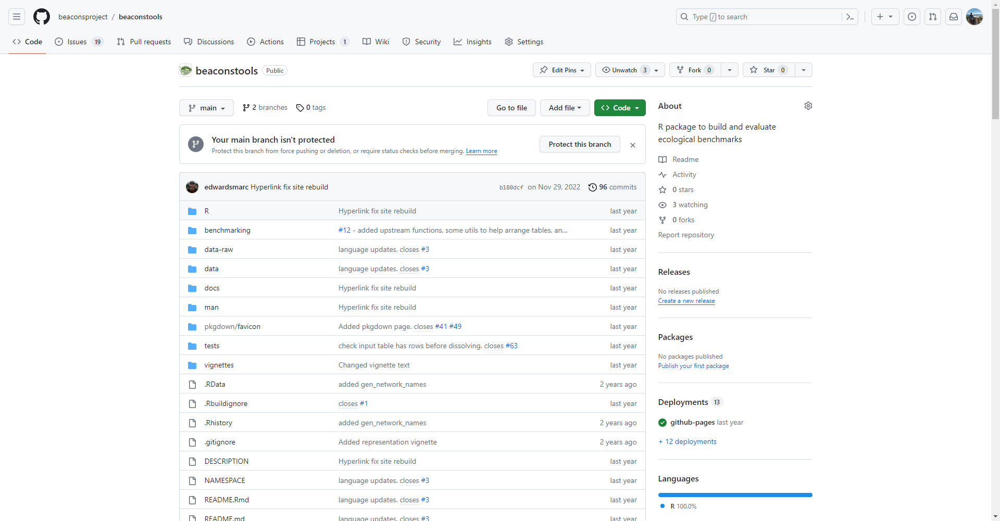

## Welcome to the BEACONs Project

The [BEACONs Project](https://beaconsproject.ualberta.ca/) was founded at the University of Alberta in recognition for a new approach to conservation planning in North America's boreal region. We are building a credible scientific framework for comprehensive conservation planning through the development and application of leading-edge conservation science that includes consideration of both protected areas and lands managed for other values. The premise of our research is that the ultimate goal of conservation is to identify human activities that are compatible with the maintenance of biological diversity and integrity of ecological systems. The conceptual scientific framework guiding our research is the Conservation Matrix Model.

Within these pages* we maintain documentation, packages, apps, and code to support several conservation related initiatives in the boreal region, including:
* Documentation related to disturbance mapping, connectivity analysis, and survey design.
* R/Shiny apps to assist in disturbance mapping, survey design, and conservation area evaluation.
* R packages to facilitate large scale conservation planning and biodiversity assessment.

For more information regarding the BEACONs Project, please email beacons [at] ualberta.ca.

## Active Projects

| [Disturbance Mapping](https://github.com/beaconsproject/disturbance_mapping) | [Connectivity Mapping](https://github.com/beaconsproject/connectivity_mapping) | [Conservation Datasets](https://github.com/beaconsproject/datasets) |
| :---: | :---: | :---: |
|  |  |  |
|  |  |  |

## Shiny Apps

| [Regional Disturbance Explorer](https://github.com/beaconsproject/regional_disturbance_explorer) | [Wolverine Survey Design](https://github.com/prvernier/wolverines) | [Conservation Area Explorer](https://github.com/beaconsproject/conservation_area_explorer) |
| :---: | :---: | :---: |
|  |  |  |
|  |  |  |

## R Packages

| [beaconstools](https://github.com/beaconsproject/beaconstools) | [beaconsbuilder](https://github.com/beaconsproject/beaconsbuilder) | [BEACONs-upstream-catchments](https://github.com/beaconsproject/BEACONs-upstream-catchments) |
| :---: | :---: | :---: |
|  |  |  |
|  |  |  |

* Note that not all pages are publicly available at this time.
