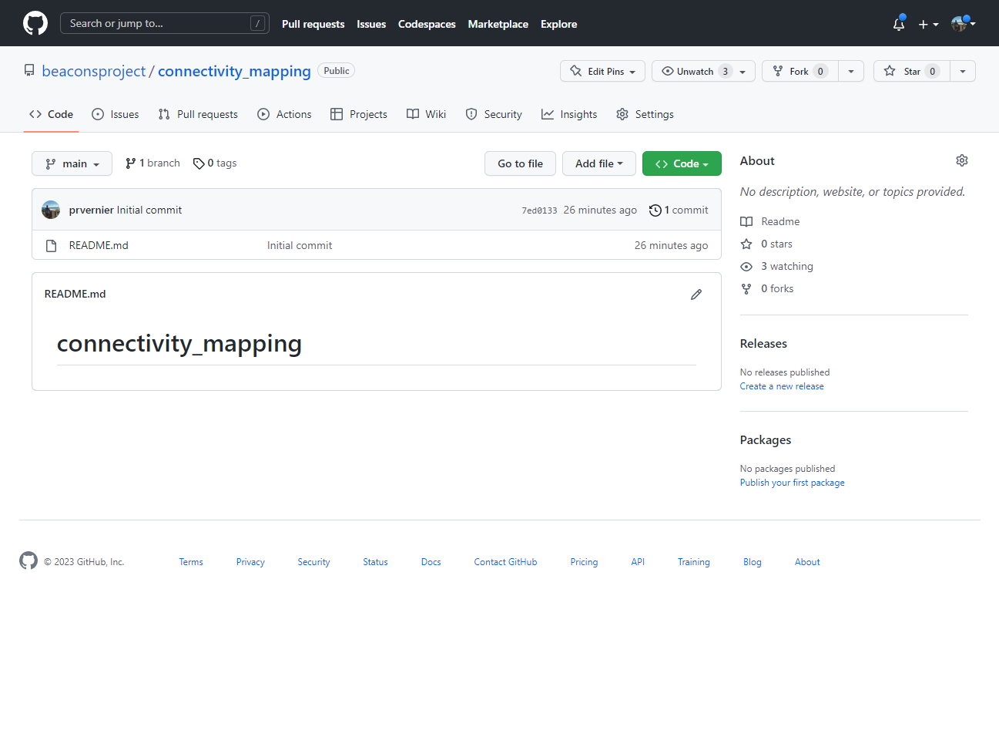
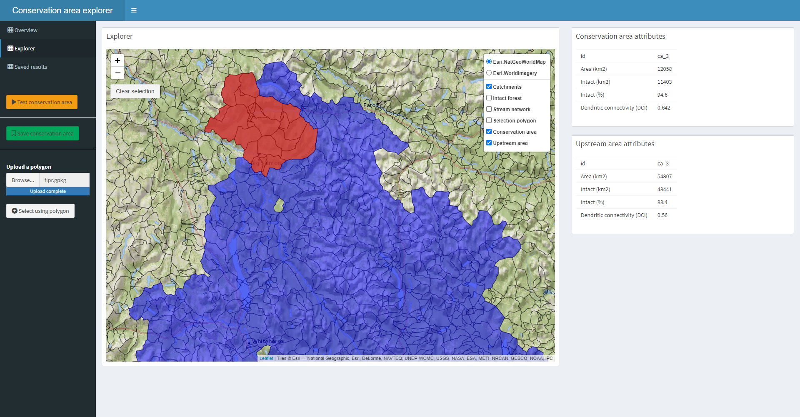

## A Workflow for Evaluating the Integrity and Connectivity of Conservation Areas

The [BEACONs Project](https://beaconsproject.ualberta.ca/) was founded at the University of Alberta in recognition for a new approach to conservation planning in North America's boreal region. We are building a credible scientific framework for comprehensive conservation planning through the development and application of leading-edge conservation science that includes consideration of both protected areas and lands managed for other values. The premise of our research is that the ultimate goal of conservation is to identify human activities that are compatible with the maintenance of biological diversity and integrity of ecological systems. The conceptual scientific framework guiding our research is the Conservation Matrix Model.

Within these pages we describe a workflow that can be used to evaluate the integrity and connectivity of a study or planning region. The workflow consists of several steps outlined in the flowchart below and described in detail after that.

In this section, you will find a description of each step in the workflow consisting of:
* A set of slides describing the step;
* An R/Shiny app to assist in implementing the step; and, for more advanced users,
* Sample R code allowing more flexibility in designing and conducting an analysis.

## Step 1. Preparing spatial database

| Introduction | App-based analysis | Code-based analysis |
| :---: | :---: | :---: |
|  |  |  |
|  |  |  |

## Step 2. Mapping anthropogenic disturbances

| [Regional Disturbance Explorer](https://github.com/beaconsproject/regional_disturbance_explorer) | [Wolverine Survey Design](https://github.com/beaconsproject/wolverines) | [Conservation Area Explorer](https://github.com/beaconsproject/conservation_area_explorer) |
| :---: | :---: | :---: |
|  |  |  |
|  |  |  |

## Step 3. Mapping landscape intactness

| [beaconstools](https://github.com/beaconsproject/beaconstools) | [beaconsbuilder](https://github.com/beaconsproject/beaconsbuilder) | [beaconshydro](https://github.com/beaconsproject/beaconshydro) |
| :---: | :---: | :---: |
|  |  |  |
|  |  |  |

## Step 4. Evaluating hydrological connectivity

## Step 5. Evaluating terrestrial connectivity

